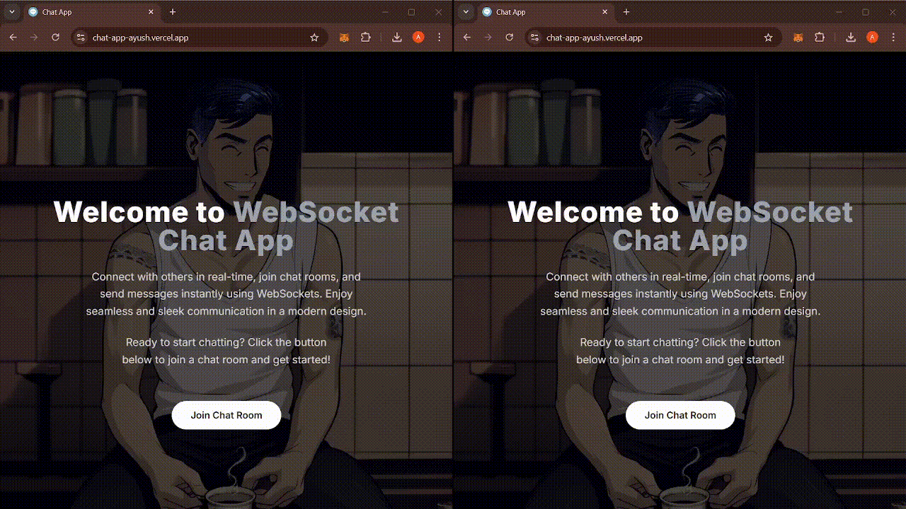

# Chat Application

A scalable chat application built using **Next.js**, **Tailwind**, **WebSockets**, and **Redis Pub/Sub** for real-time communication. The app is designed to handle multiple rooms across different WebSocket servers, ensuring scalability and efficient message delivery.

When a user sends a message, the WebSocket server forwards it to the Redis Pub/Sub system, which broadcasts it to all WebSocket servers subscribed to that room. This architecture allows seamless communication between users across different servers.

## Features:
- **Real-time messaging** across multiple rooms.
- **Scalable architecture** utilizing WebSockets and Redis.
- Easy setup with **Docker**.

## Tech Stack

- Next.js
- Tailwind
- Websockets
- Redis Pub/Sub
- Docker
- CI/CD for deployment to Docker Hub

## Architecture


When a user selects a particular room, if there are no users already present in that room, the WebSocket server subscribes to that room. Any messages sent by the user are published to the Redis Pub/Sub system via the WebSocket server. From there, Redis broadcasts the message to all WebSocket servers subscribed to that room. This approach allows the app to scale efficiently.

### Example:
Let's say two WebSocket servers are running: `ws1` and `ws2`. A user connects to `ws1` and joins `room1`. Since this is the first user in `room1`, `ws1` subscribes to `room1`. If another user joins `room1` via `ws1`, the server doesn't need to resubscribe.

If the first user sends a message in `room1`, it is forwarded from `ws1` to Redis Pub/Sub, which broadcasts it back to `ws1`, where the message is delivered to the user(s) in `room1`.

**Why is this important?**

Later, if a third user connects to `ws2` and joins `room1`, `ws2` will subscribe to the `room1` channel via the Pub/Sub system. This ensures that both WebSocket servers (`ws1` and `ws2`) are synced with `room1`, enabling the app to scale across multiple servers efficiently.

## Preview


<p align="center">
  
</p>

## Running the project locally

There is a [docker-compose.yml](./docker-compose.yml) in the project root. To run the app locally, use the following commands:

```bash
git clone https://github.com/Ayush272002/Chat-App.git
cd Chat-App
docker-compose up
```

**Note**: Environment variables can't be injected into the Next.js app during the Docker build process, as client-side variables need to be available before the build.

## Contributing

Contributions are welcome! If you have suggestions for new features, bug fixes, or improvements, feel free to fork the repository and submit a pull request. For major changes, please open an issue first to discuss what you'd like to change.

## License

This project is licensed under the MIT License. See the [LICENSE](LICENSE) file for details.

## Contact

If you have any questions or suggestions, feel free to reach out.